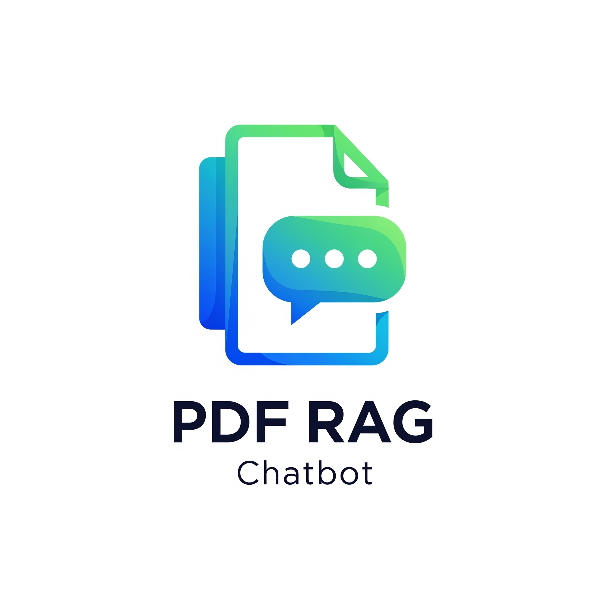

# Build RAG Chatbot Application using Streamlit
This is a project for creating a RAG chatbot in Vietnamese languague.

## Information
- Embedding model:bkai-foundation-models/vietnamese-bi-encoder
- LLM model (by default): vicuna-7b-v1.5

## Added features
- Upload multiple PDF files.
- AI model customizable: The AI model vicuna-7b-v1.5 is loaded by default. User can choose another LLM model. In this case, the webpage will be reloaded.